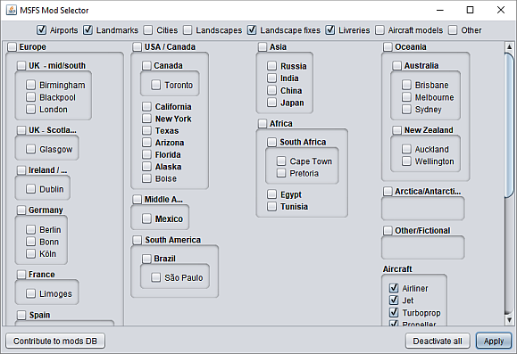

# MSFS-Mod-Selector



The MSFS mod selector solves a common problem in **Microsoft Flight Simulator 2020 (MSFS)**: even though only a few weeks after release, there are hundreds of high-quality **community-created mods** to enhance MSFS experience even further, installing a large number of them considerably slows down MSFS startup time to an unbearable point.

A simple manual solution is to manually copy only the mods you want to use at one time before starting the simulator.

The Mod Selector assists you in this by **automating the selection process**: it allows you to easily group mods by type and (for world enhancements which would be most mods) by continent, country, and even by city.

Here’s how this works:
* You must register each mod once with the Mod Selector.
* Then, start up the Mod Selector before starting MSFS.
* Simply select all the mod categories you want to activate.
* The Mod Selector will automatically copy the relevant mods into your Community folder / move away all unwanted mods into a temp folder.
* Then, start MSFS and enjoy a significantly decreased startup time.

## Usage warning
This program is very early beta. USE AT YOUR OWN RISK!
It is highly recommended that you create a backup of your mods (MSFS Community folder) before using this program.

## Project roadmap
All of this is subject to change.
* V. 0.3: Ability to add more meta-information to individual mods: description, ICAO code, author, website.
* V. 0.4: Create a central online repository for mod lookup so individual users don’t have to create their own mods.txt themselves manually.
* V. 0.5: Make continent sub-panel sizes adjustable; show mod selection feedback.
* V. 0.6: Intelligent wizard for adding mods to mods.txt.
* V. 0.7: Local / online individual mod search by keywords.

## Prerequisites
Mod Selector requires Java to run.

## Download
Download the [latest version ZIP file](https://github.com/captn-nick/MSFS-Mod-Selector/releases/download/0.2/MsfsModSelector.0.2.zip) from the [Releases page](https://github.com/captn-nick/MSFS-Mod-Selector/releases).
No installation is required. Simply unzip the content of the ZIP file into the MSFS “Package” folder.

The program consists of 3 components:
* **MsfsModSelector.jar**: the program file.
* **mods.txt**: a text file containing information about all the mods managed by the Mod selector.
* **config.properties**: a text file containing all configurations for the Mod selector.

## Setup
No setup is required.

Start the Mod Selector by double-clicking the program file or via the command line, see below.

If you placed the Mod Selector into your MSFS “Package” folder, the Mod Selector will recognize the sub-folder “Community” as the directory to place all active mods into, and the sub-folder “Temp” as the directory to temporarily store deactivated mods. **You need to create the “Temp” sub-folder if it doesn’t exist already before starting the program.**

Alternatively, you can config those paths manually, see below.

Afterwards, the Mod Selector will start.

## Config
The **config.properties** files contains the Mod Selector configuration. A single config consists of a

```key=value```

entry.

The following keys are of note:
* ```path.community```: the full path of the Community mod directory
* ```path.temp```: the full path of the temporary mod directory. Disabled mods will be stored here.
* ```ModType.defaultSelection```: defines which mod types are selected by default.
* ```ModType.XY```: defines the name of mod type XY as it is displayed in the UI.
* ```Continent.XY.Countries```: defines which countries to show in the UI for individual selection and in which order for continent XY.
* ```Continent.XY```: defines the name of continent XY as it is displayed in the UI.
* ```Country.XY```: defines the name of country XY as it is displayed in the UI.

Note:
* For the paths, backslashes have to be doubled (```\\``` instead of ```\```).
* You are free to define your own countries. As long as at least one mod is designated to this country (and defines a continent as well), Mod Selector will be able to link this country to its continent, i.e. a country does not have to be listed explicitly in any Continent.XY.Countries entry.
* You are free to define your own cities simply by linking them to any mod (see below). For cities, no config is required. All cities explicitly linked to any mod will show up in the UI in alphabetical order.
* The US are their own continent simply because that way we can group mods on two levels by state and city which seems to make sense.

## Adding a mod
In order to add a mod under Mod Selector management, you must:
* place the mod folder in the Community or Temp directory
* add an entry to the **mods.txt** file

A mods.txt file entry consists of a

```Type\tContinent\tCountry\tName\tCity```

entry whereas
* ```Type```: abbreviation of one of the supported types. Supported types are:
  * ```AP```: airport
  * ```LM```: individual landmarks
  * ```CT```: entire cities
  * ```LS```: individually modeled big landscape features, e.g. mountains (typically contain big texture files)
  * ```LF```: general landscape fixes, e.g. river elevation fixes (typically don’t contain any texture files)
  * ```LI```: airplane livreries
* ```Continent```: abbreviation of one of the supported continents. Leave blank for livrery mods.
* ```Country```: abbreviation of a country. Leave blank for livrery mods
* ```Name```: The exact folder name of the mod in question.
* ```City```: The actual name (no abbreviation!) of the city. Omit this and the preceding tab if not used.
* ```\t```: a single tab character. The 5 elements are _separated by tabs_.

Examples (note: this project is not affiliated with these mods in any way):
* ```AP\tEU\tUK\tairport-eght-tresco-superspud``` for https://flightsim.to/file/598/eght-tresco-isles-of-scilly-uk, an airport in the UK, Europe.
* ```LM\tOZ\tNZ\taucklandharbourbridge\tAuckland``` for https://flightsim.to/file/146/auckland-harbour-bridge, the Harbour Bridge landmark in Auckland, New Zealand, Oceania.
* ```LS\tUS\t\tdevilstower-wyoming``` for https://flightsim.to/file/186/devil-s-tower, the Devil's Tower, a landscape feature in the US (here, as an example, I omitted the "country" part).
* ```LI\t\t\tliveries-xcub``` for the X-Cub part of the Livreries mega pack, as featured on https://flightsim.to/.

(Note to replace ```\t``` with a actual tab in these examples.)

## Start and usage
* Start the Mod Selector by double-clicking the program file or via the command line, see below.
* If there are startup errors / warnings, see below.
* Otherwise, the main UI will show up.
* In the top bar, you can globally select / deselect entire mod categories. Note that liveries are not bound to any of the geographical areas below.
* In the main UI, you can select / deselect mods by continent, country, and city.
* Click on Apply to move all activated mods into the Community folder and all deactivated mods into the Temp folder.
* (Click on Deactivate all to quickly move all mods from the Community folder into the Temp folder, regardless of your current selection.)
* Then, startup MSFS.

Please note the way geographical selection works. Geographical selection is actually “subtractive”. That means: If you don’t activate a sub-region (country / city) that sub-region will be deactivated even if the parent region is activated. Selecting a parent region will only activate all mods which are not explicitly part of one of the listed sub-regions.

For instance, if you select Europe and France but not Germany, no mods from Germany will be activated; however, all mods from France will be activated plus all mods from regions of Europe which are not explicitly shown in the UI. For instance, if you had a mod linked to Liechtenstein and Liechtenstein is not explicitly listed as a country of Europe it will be activated only when Europe as a continent is selected.

Same goes for cities: if you select Europe and France but not Paris, and also not Germany but Berlin, no mods from Germany will be loaded but mods explicitly linked to Berlin will; all mods from France will be loaded but none explicitly linked to Paris will; as in the example above, Liechtenstein mods would also be loaded.

Deselect Europe and all of its countries and cities except for Berlin to activate no single mod in the entirety of Europe except for all which are explicitly linked to Berlin.

In that way, selecting an entire continent / country (with cities) actually means “activate the rest of…”. I believe this is a good solution. Otherwise, we would always have to present you an explicit “the rest of” option for all “container” regions.

## Warnings and errors
At the start, the Mod Selector will check your mod registry and your directories for problems and show you an error message if it found any. You cannot start the Mod Selector without first resolving those issues.

## Starting from the command line
Instead of double-clicking on the program file, you can start the program from the command line / PowerShell with

```java –jar MsfsModSelector.jar```

When started in command line mode, all errors will be printed to the console.

Supported command line arguments:
* ```--dontShowErrorPopups```: shows errors only on the command line, not as popups (in case you prefer it that way)

## Usage tips
For installing new mods:
* First, use the “Deactivate all” function to move all current mods into the Temp folder.
* Then, copy/move/unzip your newly-downloaded mods into the Community folder.
* Run the Mod Selector and watch out for its warning messages. Add mods to the mods.txt file (or correct mod sub-directory structure, if needed; or remove duplicated mods) to correct the errors step by step.
* Finally, when the UI shows up, you can be sure that you again have clean mod folders and that all mods are correctly registered with Mod Selector.

## Known limitations
This program is very early beta. I have created it as a very quick & dirty solution for my own personal use but eventually decided to release it publicly, even if of little use.
Known limitations include:
* No auto-discovery / assistance to add mods. All mods have to be added manually in the mods.txt file.
* Mod Selector will not remember the last selection but always start up in the default selection.
* Only limited possibilities to re-arrange geographical areas on the UI.
* Doesn’t help identifying individual mods. Mods are simply kept in their (oftentimes chaotically named) directory structures.
* Only limited error handling and feedback.
* (Development: unclean build process.)
* And probably a few more improvements which would be “nice to have”…

## Version history
* 0.1: Initial release
* 0.2:
  * warning/error feedback trough UI;
  * configuration for mod types, including default selection;
  * bugfix for UTF-8 support.

## Upgrade guide
* 0.1 -> 0.2:
  * Make sure to add the ```ModType.defaultSelection``` and ```ModType.XY``` sections to your config.properties file.

## Troubleshooting
If there is a problem (e.g. the program doesn’t start up on double click), start it from the command line (see above) to make sure all errors are shown.

## For Developers
This project was built using the NetBeans IDE. JFrames and JPanels are created and edited with the IDE’s Swing editor.

## Closing note
This program will also be available for download through https://flightsim.to/.

## Happy Flying!
